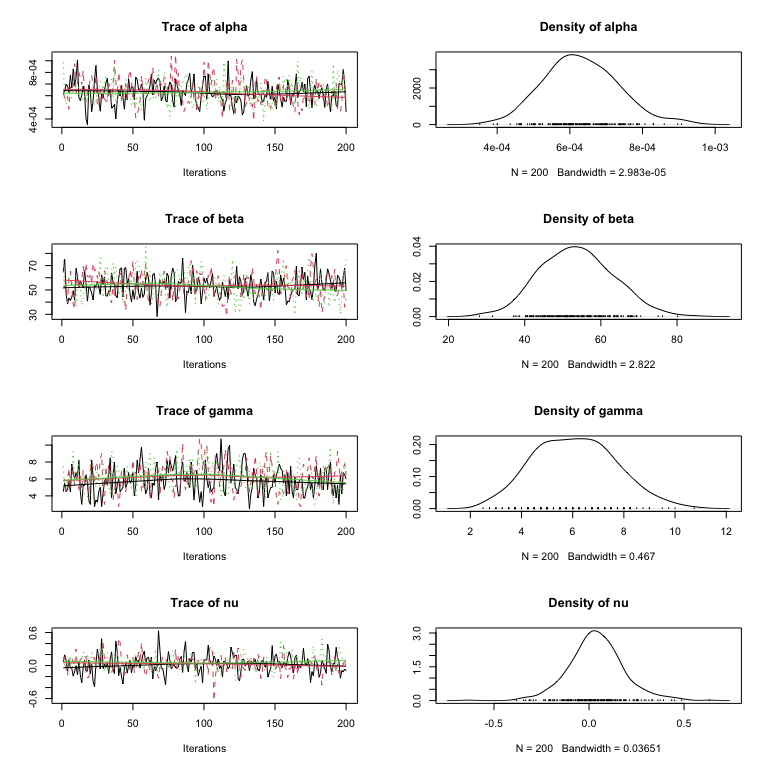
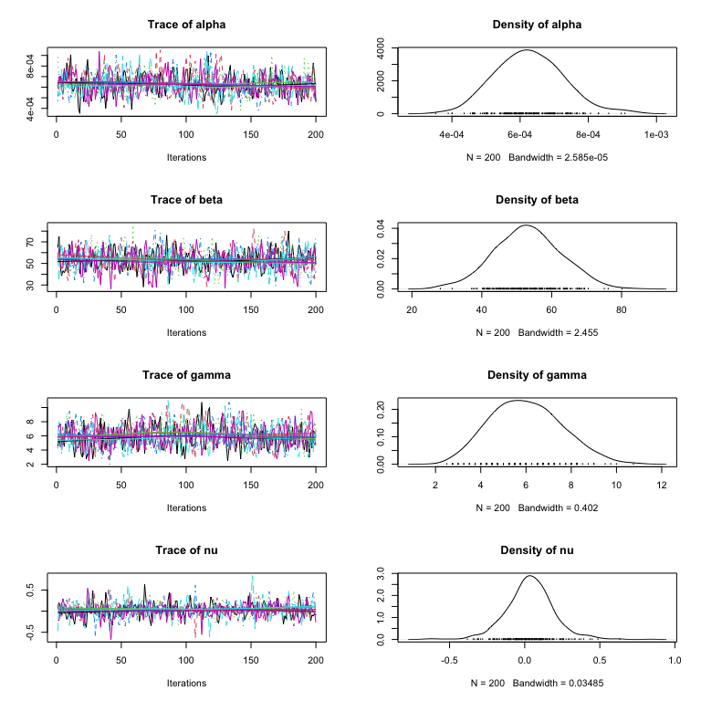

<!-- README.md is generated from README.Rmd. Please edit that file -->

# mcgibbsit

<!-- badges: start -->

[](https://CRAN.R-project.org/package=mcgibbsit)
[](https://lifecycle.r-lib.org/articles/stages.html#stable)
<!-- badges: end -->

Implementation of Warnes & Raftery’s MCGibbsit run-length diagnostic for
a set of (not-necessarily independent) MCMC samplers.

It combines the estimate error-bounding approach of the Raftery and
Lewis MCMC run length diagnostic (`gibbsit`) with the between verses
within chain approach of the Gelman and Rubin MCMC convergence
diagnostic.

## Installation

Install the most recent release from `CRAN`:

``` r
install.packages("mcgibbsit")
```

Or the current development version from `github`:

``` r
if(!require("remotes"))
  install.packages("remotes")
  
remotes::install_github('r-gregmisc/mcgibbsit')
```

## Example

This basic example constructs a dummy set of files for 20 MCMC runs from
an *imaginary* MCMC sampler and shows the results of running `mcgibbsit`
with the default settings, which calculate the total number of samples
needed to provide accurate 95% posterior confidence region estimates for
all four of the parameters.

``` r
library(mcgibbsit)
#> Loading required package: coda

###
# Create example data files for 20 independent chains
# with serial correlation of 0.25
###

set.seed(42)
tmpdir <- tempdir()

nsamples <- 200

# Define a function to generate the output of our imaginary MCMC sampler
gen_samples <- function(run_id)
{
  x <- matrix(nrow = nsamples+1, ncol=4)
  colnames(x) <- c("alpha","beta","gamma", "nu")
  
  x[,"alpha"] <- rnorm (nsamples+1, mean=0.025, sd=0.0025)^2
  x[,"beta"]  <- rnorm (nsamples+1, mean=53,    sd=12)
  x[,"gamma"] <- rbinom(nsamples+1, 20,         p=0.25) + 1
  x[,"nu"]    <- rnorm (nsamples+1, mean=x[,"alpha"] * x[,"beta"], sd=1/x[,"gamma"])
#'
  # induce serial correlation of 0.25
  x <- 0.75 * x[2:(nsamples+1),] + 0.25 * x[1:nsamples,]
  
  
  write.table(
    x,
    file = file.path(
      tmpdir,
      paste("mcmc", i, "csv", sep=".")
      ),
    sep = ",",
    row.names = FALSE
  )
}
```

First, we’ll generate and load only a 3 runs of length 200:

``` r
# Generate and load 3 runs 
for(i in 1:3)
  gen_samples(i)
  
mcmc.3 <- read.mcmc(
  3, 
  file.path(tmpdir, "mcmc.#.csv"), 
  sep=",",
  col.names=c("alpha","beta","gamma", "nu")
  )
```

``` r
# Trace and Density Plots
plot(mcmc.3)
```



Now run `mcgibbsit` to determine the necessary number of MCMC samples:

``` r
# And check the necessary run length 
mcg.3 <- mcgibbsit(mcmc.3)
print(mcg.3)
#>                   Multi-Chain Gibbsit 
#>                   ------------------- 
#> 
#> Call             = mcgibbsit(data = mcmc.3)
#> 
#> Number of Chains = 3 
#> Per-Chain Length = 200 
#> Total Length     = 600 
#> 
#> Quantile (q)     = 0.025 
#> Accuracy (r)     = +/- 0.0125 
#> Probability (s)  = 0.95 
#> 
#>                                                                         
#>       Burn-in  Estimation Total Lower bound  Auto-Corr. Between-Chain   
#>       (M)      (N)        (M+N) (Nmin)       factor (I) Corr. factor (R)
#>                                                                         
#> alpha 12       823        835   600          1.27       1.090           
#> beta  6        548        554   600          0.96       0.953           
#> gamma 9        660        669   600          1.16       0.951           
#> nu    12       725        737   600          1.27       0.957           
#>       -----    -----      ----- -----        -----      -----           
#>       12       823        835                                           
#> 
#> NOTE: The values for M, N, and Total are combined numbers of iterations 
#>       based on using 3 chains.
```

**Interpretation**: `mcgibbsit` estimated that a total of required
number of samples is 835, which is less than we’ve generated so far.

Just to be safe we’ll add 3 more runs for a total of 6 runs, each of
length 200, for a total of 1,200 samples

``` r
# Generate and load 3 runs 
for(i in 4:6)
  gen_samples(i)
  
mcmc.6 <- read.mcmc(
  6, 
  file.path(tmpdir, "mcmc.#.csv"), 
  sep=",",
  col.names=c("alpha","beta","gamma", "nu")
  )
```

``` r
# Trace and Density Plots
plot(mcmc.6)
```



Now run `mcgibbsit` to determine the necessary number of MCMC samples:

``` r
# And check the necessary run length 
mcg.6 <- mcgibbsit(mcmc.6)
print(mcg.6)
#>                   Multi-Chain Gibbsit 
#>                   ------------------- 
#> 
#> Call             = mcgibbsit(data = mcmc.6)
#> 
#> Number of Chains = 6 
#> Per-Chain Length = 200 
#> Total Length     = 1200 
#> 
#> Quantile (q)     = 0.025 
#> Accuracy (r)     = +/- 0.0125 
#> Probability (s)  = 0.95 
#> 
#>                                                                         
#>       Burn-in  Estimation Total Lower bound  Auto-Corr. Between-Chain   
#>       (M)      (N)        (M+N) (Nmin)       factor (I) Corr. factor (R)
#>                                                                         
#> alpha 24       662        686   600          1.27       0.874           
#> beta  24       881        905   600          1.36       1.090           
#> gamma 18       862        880   600          1.46       0.988           
#> nu    12       525        537   600          0.998      0.878           
#>       -----    -----      ----- -----        -----      -----           
#>       24       881        905                                           
#> 
#> NOTE: The values for M, N, and Total are combined numbers of iterations 
#>       based on using 6 chains.
```

**Interpretation**: `mcgibbsit` estimated that a total of required
number of samples is 905, and since we we have already generated 1,200
samples across the 6 runs, we do not need to perform any additional runs
of our MCMC sampler.
