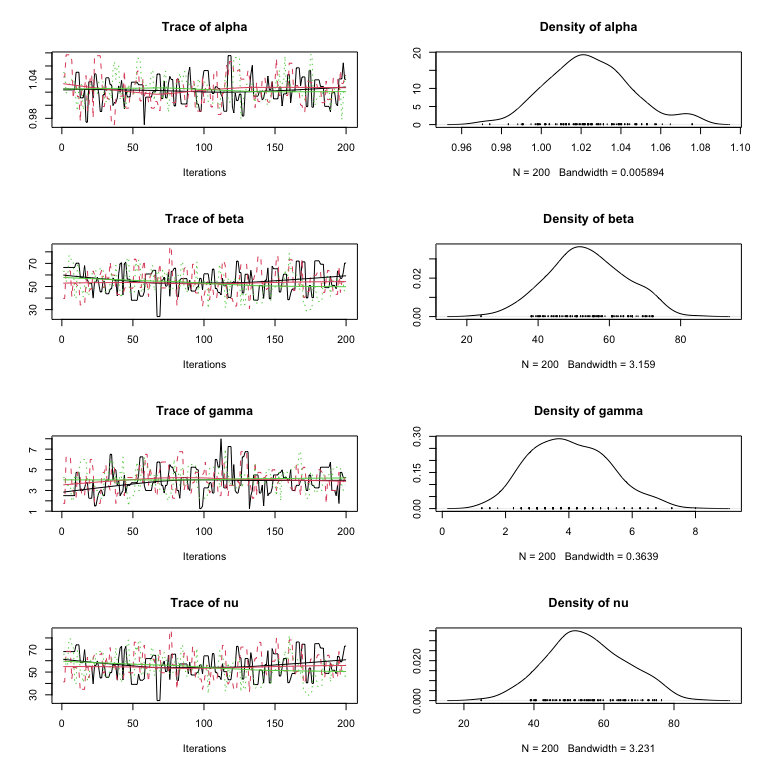

<!-- README.md is generated from README.Rmd. Please edit that file -->

# mcgibbsit

<!-- badges: start -->

[](https://CRAN.R-project.org/package=mcgibbsit)
[](https://lifecycle.r-lib.org/articles/stages.html#stable)
<!-- badges: end -->

Implementation of Warnes & Raftery’s `MCGibbsit` run-length diagnostic
for a set of (not-necessarily independent) Markov Chain Monte Carlo
(MCMC) samplers.

It combines the estimate error-bounding approach of the Raftery and
Lewis MCMC run length diagnostic (`gibbsit`) with the between verses
within chain approach of the Gelman and Rubin MCMC convergence
diagnostic.

## Installation

Install the most recent release from `CRAN`:

``` r
install.packages("mcgibbsit")
```

Or the current development version from `github`:

``` r
if(!require("remotes"))
  install.packages("remotes")
  
remotes::install_github('r-gregmisc/mcgibbsit')
```

``` r
library(mcgibbsit)
#> Loading required package: coda

set.seed(42)        # for reproducibility
tmpdir <- tempdir()
```

The `mcgibbsit` package provides an implementation of Warnes & Raftery’s
MCGibbsit run-length diagnostic for a set of (not-necessarily
independent) MCMC samplers. It combines the estimate error-bounding
approach of Raftery and Lewis with the between chain variance verses
within chain variance approach of Gelman and Rubin.

`mcgibbsit` computes the minimum run length $N_{min}$, required burn in
$M$, total run length $N$, run length inflation due to
*auto-correlation*, $I$, and the run length inflation due to
*between-chain* correlation, $R$ for a set of exchangeable MCMC
simulations which need not be independent.

The normal usage is to perform an initial MCMC run of some
pre-determined length (e.g. 300 iterations) for each of a set of $k$
(e.g. 20) MCMC samplers. The output from these samplers is then read in
to create an `mcmc.list` object and `mcgibbsit` is run specifying the
desired accuracy of estimation for quantiles of interest. This will
return the minimum number of iterations to achieve the specified error
bound. The set of MCMC samplers is now run so that the total number of
iterations exceeds this minimum, and `mcgibbsit` is again called. This
should continue until the number of iterations already complete is less
than the minimum number computed by `mcgibbsit`.

If the initial number of iterations in `data` is too small to perform
the calculations, an error message is printed indicating the minimum
pilot run length.

## Example

This basic example constructs a dummy set of files from an *imaginary*
MCMC sampler and shows the results of running `mcgibbsit` with the
default settings.

``` r
# Define a function to generate the output of our imaginary MCMC sampler
gen_samples <- function(run_id, nsamples=200)
{
  x <- matrix(nrow = nsamples+1, ncol=4)
  colnames(x) <- c("alpha","beta","gamma", "nu")
  
  x[,"alpha"] <- exp(rnorm (nsamples+1, mean=0.025, sd=0.025))
  x[,"beta"]  <- rnorm (nsamples+1, mean=53,    sd=14)
  x[,"gamma"] <- rbinom(nsamples+1, 20,         p=0.15) + 1
  x[,"nu"]    <- rnorm (nsamples+1, mean=x[,"alpha"] * x[,"beta"], sd=1/x[,"gamma"])
#'
  # induce serial correlation of 0.25
  x <- 0.75 * x[2:(nsamples+1),] + 0.25 * x[1:nsamples,]

  # induce ~50% acceptance rate
  accept <- runif(nsamples) > 0.50
  for(i in 2:nsamples)
    if(!accept[i]) x[i,] <- x[i-1,]

  write.table(
    x,
    file = file.path(
      tmpdir,
      paste("mcmc", run_id, "csv", sep=".")
      ),
    sep = ",",
    row.names = FALSE
  )
}
```

First, we’ll generate and load only a 3 runs of length 200:

``` r
# Generate and load 3 runs 
for(i in 1:3)
  gen_samples(i, 200)
  
mcmc.3 <- read.mcmc(
  3, 
  file.path(tmpdir, "mcmc.#.csv"), 
  sep=",",
  col.names=c("alpha","beta","gamma", "nu")
  )
```

``` r
# Trace and Density Plots
plot(mcmc.3)
```



Now run `mcgibbsit` to determine the necessary total number of MCMC
samples to to provide accurate 95% posterior confidence region estimates
for all four of the parameters:

``` r
# And check the necessary run length 
mcg.3 <- mcgibbsit(mcmc.3)
print(mcg.3)
#>                   Multi-Chain Gibbsit 
#>                   ------------------- 
#> 
#> Call             = mcgibbsit(data = mcmc.3)
#> 
#> Number of Chains = 3 
#> Per-Chain Length = 200 
#> Total Length     = 600 
#> 
#> Quantile (q)     = 0.025 
#> Accuracy (r)     = +/- 0.0125 
#> Probability (s)  = 0.95 
#> 
#>                                                                         
#>       Burn-in  Estimation Total Lower bound  Auto-Corr. Between-Chain   
#>       (M)      (N)        (M+N) (Nmin)       factor (I) Corr. factor (R)
#>                                                                         
#> alpha 24       1301       1325  600          2.28       0.955           
#> beta  33       1830       1863  600          3.22       0.951           
#> gamma 27       1932       1959  600          2.74       1.180           
#> nu    33       1849       1882  600          3.22       0.961           
#>       -----    -----      ----- -----        -----      -----           
#>       33       1932       1959  600                                     
#> 
#> NOTE: The values for M, N, and Total are combined numbers of iterations 
#>       based on using 3 chains.
```

The results from `mcgibbsit` indicate that the required number of
samples is 1,959, which is less than we’ve generated so far.

Lets generate 7 more runs, each of length 200, for a total of 2,000
samples:

``` r
# Generate and load 7 more runs 
for(i in 3 + (1:7))
  gen_samples(i, 200)
  
mcmc.10 <- read.mcmc(
  10, 
  file.path(tmpdir, "mcmc.#.csv"), 
  sep=",",
  col.names=c("alpha","beta","gamma", "nu")
  )
```

``` r
# Trace and Density Plots
plot(mcmc.10)
```


Now run `mcgibbsit` to determine the necessary number of MCMC samples:

``` r
# And check the necessary run length 
mcg.10 <- mcgibbsit(mcmc.10)
print(mcg.10)
#>                   Multi-Chain Gibbsit 
#>                   ------------------- 
#> 
#> Call             = mcgibbsit(data = mcmc.10)
#> 
#> Number of Chains = 10 
#> Per-Chain Length = 200 
#> Total Length     = 2000 
#> 
#> Quantile (q)     = 0.025 
#> Accuracy (r)     = +/- 0.0125 
#> Probability (s)  = 0.95 
#> 
#>                                                                         
#>       Burn-in  Estimation Total Lower bound  Auto-Corr. Between-Chain   
#>       (M)      (N)        (M+N) (Nmin)       factor (I) Corr. factor (R)
#>                                                                         
#> alpha 90       1534       1624  600          2.76       0.933           
#> beta  110      1743       1853  600          3.11       0.940           
#> gamma 90       1820       1910  600          3.19       0.955           
#> nu    100      1569       1669  600          2.79       0.942           
#>       -----    -----      ----- -----        -----      -----           
#>       110      1820       1910  600                                     
#> 
#> NOTE: The values for M, N, and Total are combined numbers of iterations 
#>       based on using 10 chains.
```

`mcgibbsit` now estimates that a total of required number of samples is
1,910 (this is slightly fewer than before because the the larger number
of samples allowed more accurate estimates of the variances and
correlations). Since we we have already generated 2,000 samples, we do
not need to perform any additional runs.

We can now calculate the posterior confidence regions for each of the
parameters.

``` r
summary(mcmc.10)
#> 
#> Iterations = 1:200
#> Thinning interval = 1 
#> Number of chains = 10 
#> Sample size per chain = 200 
#> 
#> 1. Empirical mean and standard deviation for each variable,
#>    plus standard error of the mean:
#> 
#>         Mean       SD  Naive SE Time-series SE
#> alpha  1.026  0.02033 0.0004546       0.000787
#> beta  53.012 11.10534 0.2483230       0.433342
#> gamma  4.024  1.24685 0.0278804       0.046729
#> nu    54.391 11.50530 0.2572663       0.438652
#> 
#> 2. Quantiles for each variable:
#> 
#>          2.5%    25%    50%    75% 97.5%
#> alpha  0.9892  1.012  1.025  1.039  1.07
#> beta  31.1137 45.587 52.633 60.664 73.74
#> gamma  1.7500  3.000  4.000  4.750  6.75
#> nu    32.3646 46.484 54.455 61.896 76.44
```
